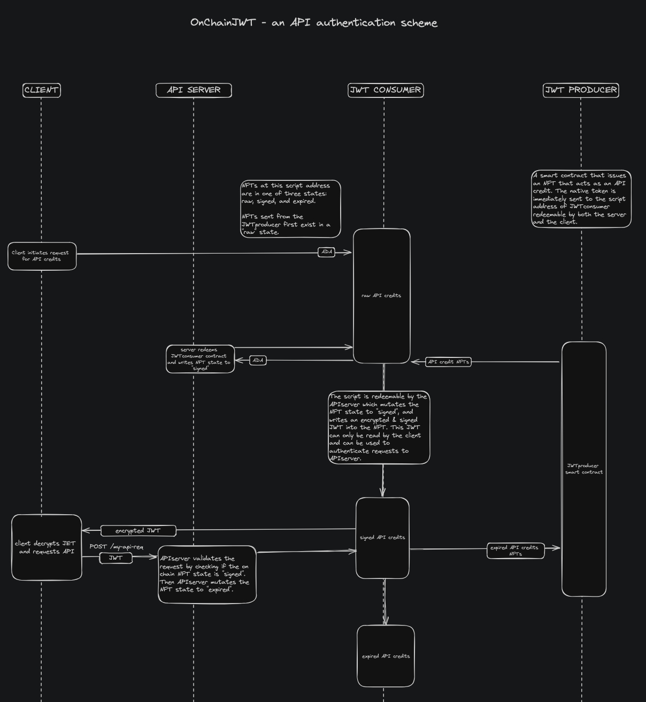
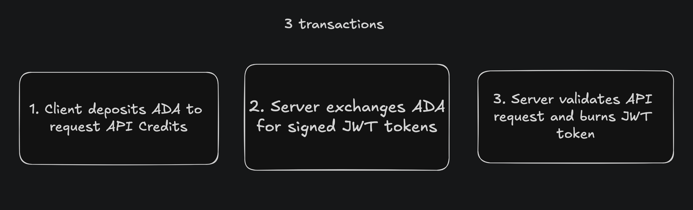
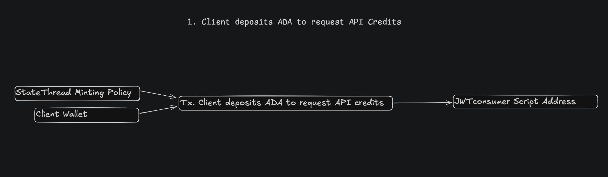
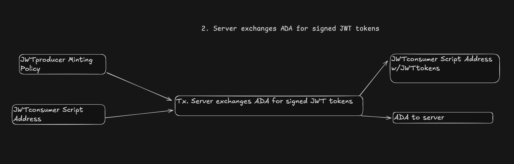
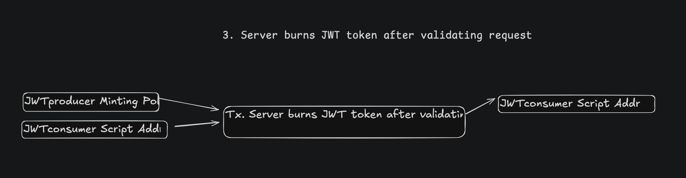
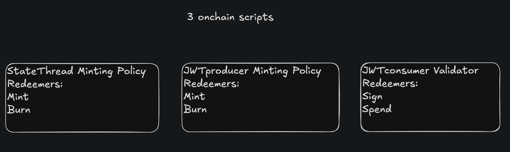

## OnChainJWT

OnChainJWT is an on chain JWT API authentication scheme. A client initiates a transaction at the first script address (JWTproducer), depositing ADA for NFTs that represent API credits. The NFTs are sent to a second script address (JWTconsumer) where they exist in one of three states: raw, signed, and expired. The APIserver redeems the JWTconsumer twice. In the first redemption, the APIserver mutates the NFT state to "signed", and writes an encrypted signed JWT into the NFT. This JWT can only be read by the client and can be used to authenticate requests to APIserver. The client decrypts and reads the JWT, requests the APIserver using the JWT. The second redemption occurs when the APIserver validates the request by checking if the on chain NFT state is "signed", at which point the APIserver returns to the client, and mutates the NFT state to "expired".

# Index

- [StateThread Minting Policy](#statethread-minting-policy)
  - [Mint Redeemer](#mint-redeemer)
    - [Input](#input)
    - [Output](#output)
  - [Burn Redeemer](#burn-redeemer)
    - [Input](#input-1)
    - [Output](#output-1)

- [JWTproducer Minting Policy](#jwtproducer-minting-policy)
  - [Mint Redeemer](#mint-redeemer-1)
    - [Params](#params)
    - [Input](#input-2)
    - [Output](#output-2)
  - [Burn Redeemer](#burn-redeemer-1)
    - [Params](#params-1)
    - [Input](#input-3)
    - [Output](#output-3)
      
- [JWTconsumer Validator](#jwtconsumer-validator)
  - [Sign Redeemer](#sign-redeemer)
    - [Params](#params-2)
    - [Datum](#datum)
    - [Input](#input-4)
    - [Output](#output-4)
  - [Spend Redeemer](#spend-redeemer)
    - [Params](#params-3)
    - [Datum](#datum-1)
    - [Input](#input-5)
    - [Output](#output-5)



# 3 Transctions






# 3 Scripts


# StateThread Minting Policy

## Mint Redeemer

### Input

```
1. No more than 1 script input  
2. Script input is StateThreadPolicy
```

### Output

```
1. Exactly 1 script output  
2. StateThread TokenName is JWTConsumer ScriptAddress  
3. Exactly 1 StateThread token minted to JWTConsumer ScriptAddress  
4. ADA paid to JWTConsumer ScriptAddress >= MIN_ADA + PRICE  
5. No additional tokens at JWTConsumer ScriptAddress  
6. JWTconsumer datum initialized correctly
```

## Burn Redeemer

### Input

```
1. Tx Signed only by Server  
2. No more than 3 script inputs: 1 JWTproducer, 1 JWTconsumer, 1 StateThread  
3. JWTconsumer script input contains only 1 StateThread token  
4. JWTconsumer script input contains JWTtokens  
5. Across all inputs, no additional tokens
```

### Output

#### If `num JWTtokens > 1`:

```
* Only 1 script output, JWTconsumer  
* JWTconsumer script output contains StateThread token  
* No additional tokens minted
```

#### If `JWTtokens = 1`:

```
* No script outputs allowed  
* StateThread token is burned
```

---

# JWTproducer Minting Policy

## Mint Redeemer

### Params

```
ServerAddress  
StateThread PolicyAddress  
JWTconsumer ScriptAddress  
Price
```

### Input

```
1. Tx Signed by Server only, no extra signatories  
2. No more than 2 specific script inputs: JWTproducer, JWTconsumer  
3. JWTconsumer script input contains StateThread token  
4. From all inputs, no additional tokens  
5. JWTconsumer datum State value is 'raw'
```

### Output

```
1. Num JWTtokens = MAX_ADA % PRICE  
2. Change sent to ServerAddress  
3. All minted tokens sent to JWTconsumer ScriptAddress  
4. ADA sent to ServerAddress  
5. JWTconsumer script output contains StateThread token
```

## Burn Redeemer

### Params

```
ServerAddress  
StateThread PolicyAddress  
JWTconsumer ScriptAddress  
Price
```

### Input

```
1. Tx Signed by Server only, no extra signatories  
2. No more than 3 specific script inputs: JWTproducer, JWTconsumer, StateThread  
3. JWTconsumer script input contains StateThread token  
4. JWTconsumer script input contains 1 <= JWTtokens <= MAX_TOKENS  
5. From all inputs, no additional tokens  
6. JWTconsumer datum State value is 'signed'
```

### Output

#### If `num JWTtokens > 1`:

```
* Only 1 script output, JWTconsumer  
* JWTconsumer script output contains all input JWTtokens - 1  
* No additional tokens minted  
* JWTconsumer script output contains StateThread token  
* Only 1 script output, JWTconsumer
```

#### If `JWTtokens = 1`:

```
* MIN_ADA sent to ServerAddress  
* No script outputs  
* No tokens across all outputs
```

---

# JWTconsumer Validator

## Sign Redeemer

### Params

```
ServerAddress  
StateThread Policy Address  
MAX_TOKENS
```

### Datum

```
State :: raw | signed | expired
```

### Input

```
1. Tx Signed by Server only, no extra signatories  
2. No more than 2 specific script inputs: 1 JWTproducer, 1 JWTconsumer  
3. JWTconsumer script input contains StateThread token  
4. From all inputs, no additional tokens, including JWTtokens  
5. Input Datum is valid  
6. Datum state value is 'raw'
```

### Output

```
1. Only 1 script output, JWTconsumer  
2. JWTconsumer script output contains StateThread token  
3. JWTconsumer script output contains JWTtokens <= MAX_TOKENS  
4. Only 1 additional output, ADA sent to ServerAddress  
5. Output datum is valid  
6. Datum state value is 'signed'
```

## Spend Redeemer

### Params

```
ServerAddress  
StateThread Policy Address  
MAX_TOKENS
```

### Datum

```
ClientAddress  
State :: raw | signed | expired
```

### Input

```
1. Tx Signed by Server only, no extra signatories  
2. No more than 3 specific script inputs: 1 JWTproducer, 1 JWTconsumer, StateThread  
3. JWTconsumer script input contains StateThread token  
4. JWTconsumer contains 1 <= JWTtokens <= MAX_TOKENS  
5. From all inputs, no additional tokens  
6. Input Datum is valid  
7. Datum state value is 'signed'
```

### Output

#### If `num JWTtokens > 1`:

```
* Only 1 script output, JWTconsumer  
* JWTconsumer script output contains all input JWTtokens - 1  
* No additional tokens minted  
* JWTconsumer script output contains StateThread token  
* Only 1 script output, JWTconsumer  
* JWTconsumer script output contains 1 <= JWTtokens <= MAX_TOKENS  
* Output datum is valid
```

#### If `JWTtokens = 1`:

```
* MIN_ADA sent to ServerAddress  
* No script outputs  
* No tokens across all outputs
```
